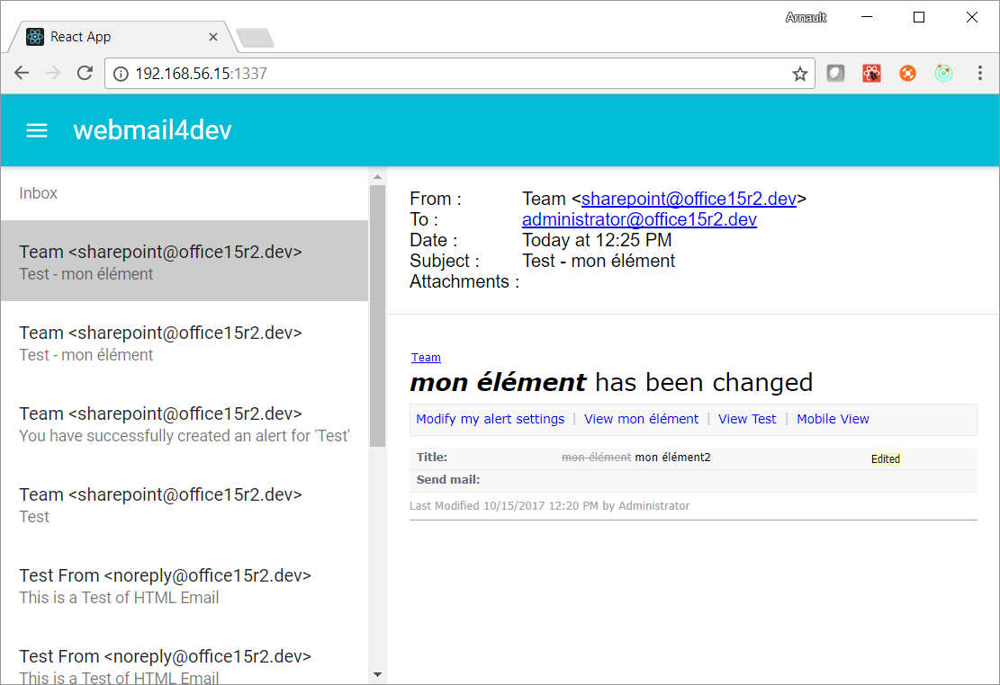

# webmail4dev

webmail4dev is a CLI/service which starts a local smtp server (with no auth) and a web server that displays all emails received by the smtp server, meant for testing environments.

It is meant to be used as an web-based fake mail server for testing applications that send emails, such as SharePoint. Using such a mail server ensures that emails are not sent to real mailboxes, while making it easy for test users to read all outgoing emails at once.

It can be seen as a web alternative to [Papercut](https://github.com/ChangemakerStudios/Papercut) or [smtp4dev](https://github.com/rnwood/smtp4dev).



## Installation

### For Linux

Requires [nodejs](https://nodejs.org/en/download/) 6.X minimum.

Install and run the application :

```bash
# install the cli globally
sudo npm install -g webmail4dev

# either run the program in current thread 
# sudo is necessary to open port 25
sudo webmail4dev

# or if you want to run it as a service, then start it
sudo webmail4dev --install
sudo service webmail4dev start
```

### For Windows

[os-service](https://github.com/stephenwvickers/node-os-service) dependency compiles C++ code during install using [node-gyp](https://www.npmjs.com/package/node-gyp), which requires python to be installed and it's path to be registered in the node environment. The easiest way to meet these requirements is to install windows-build-tools.

```bash
# FOR WINDOWS ONLY
# requires "Run as administrator" prompt
npm install --global --production windows-build-tools

# install the cli globally
npm install -g webmail4dev

# either run the program in current thread
webmail4dev

# or if you want to run it as a service
# requires "Run as administrator" prompt
webmail4dev --install
net start webmail4dev
```

### Options

Run this command to see a list of all available options:

```bash
webmail4dev --help
```
