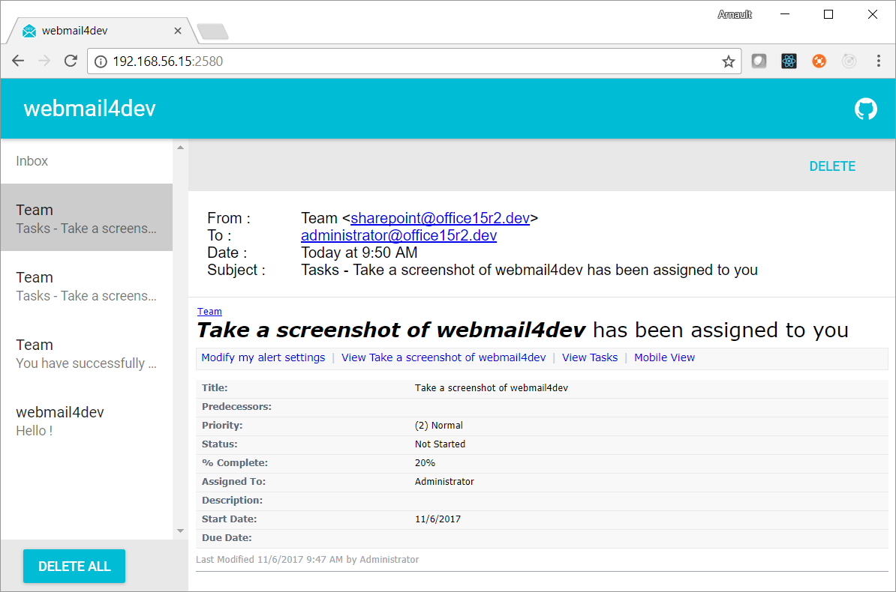

# webmail4dev

This nodejs application is composed of a SMTP server and a web server that shows all emails received by the smtp server.

It is meant to be used as an easy to use mail server for testing applications that send emails, such as SharePoint.



As a SharePoint developper (noone's perfect), when testing a workflow or other developments in a user acceptance environment, I often need to provide an easy way for key users to test emails sent by the platform. Using papercut or smtp4dev is ok for developers, but asking end users to login remotely to a server to launch a windows app isn't a perfect solution. webmail4dev is meant to address this scenario, as it's web based and requires no authentication.

I also see this project as an opportunity to train myself on nodejs, react/redux, sockets, github, etc. So all improvement suggestions are welcome :)

## Install

For now, the application isn't available as an executable binary.

The process for running the app is the following :

* clone the repository locally
* run the following commands :

```bash
cd client
npm install
cd ..
npm install
npm start
```

* Browse http://localhost:1337

This will start the SMTP on port 25, the REST api on port 3001, and the web server on the port 1337.

## Known issues (will be adressed ASAP)

* not working on IE
* you have to refresh (hit F5) to load new mails
* attachments not displayed
* smtp and web ports aren't configurable without modifying the code
* not distributed as a binary